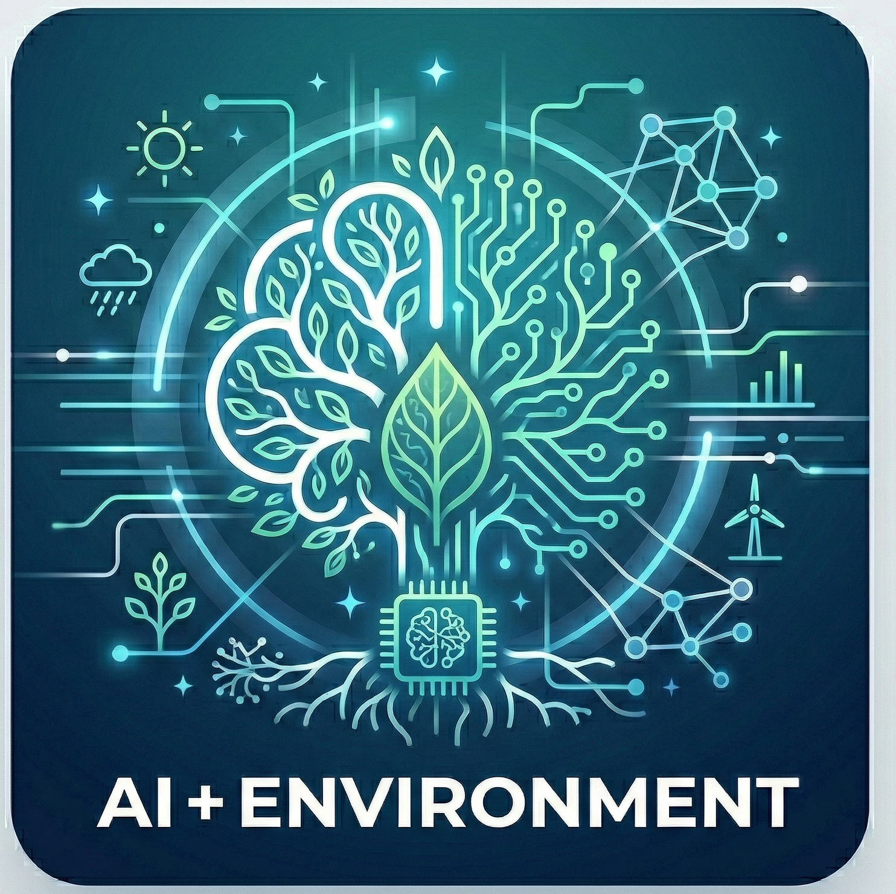

::: {.research-topic-intro}
:::{.research-topic-lead}

:::

We develop AI and other computational methods to better observe, predict, and respond to environmental systems and hazards. We focus on developing deep learning models for environmental sensing across complex natural systems.
:::

## What We Are Working On Now:
- Uncertainty and predictions for upscaling carbon flux estimates
- Upscaling Eddy-Covariance Tower measurements at high spatial resolution

## Related Publications

:::{#pubs}
:::
