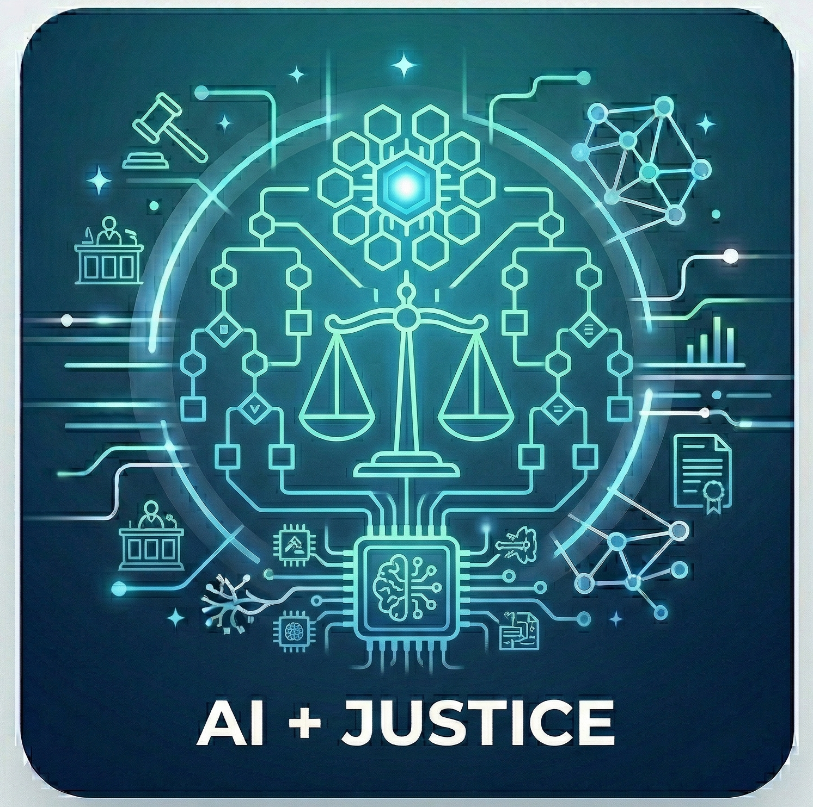

::: {.research-topic-intro}
:::{.research-topic-lead}

:::

We study how AI and data science can be used to improve fairness, access, and accountability in the systems that shape everyday life. Our research emphasizes themes such as equitable access, resource allocation, participation, and the evaluation of institutional decision-making. The broader goal is to design tools and evidence that help partners reduce barriers, distribute opportunities and services more justly, and make policy and practice more equitable.
:::

## What We Are Working On Now:

- Supporting decision-making in parole hearings with computational tools.

## Related Publications

:::{#pubs}
:::
